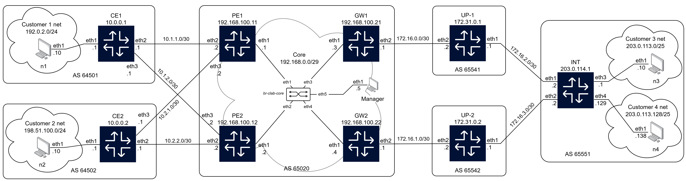
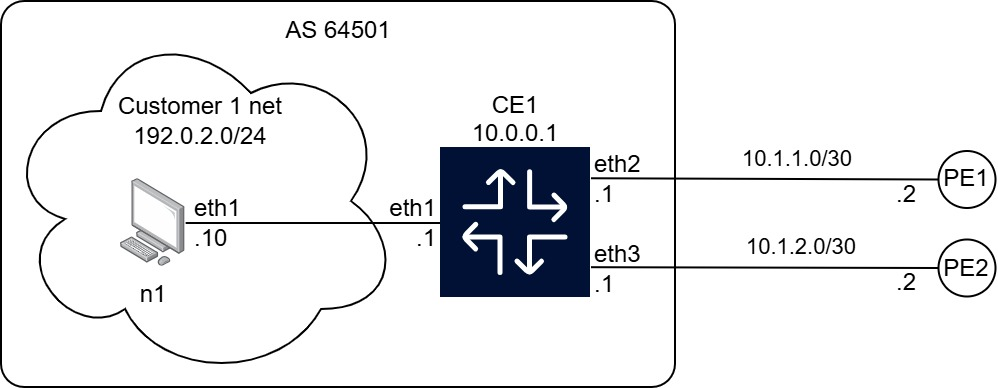
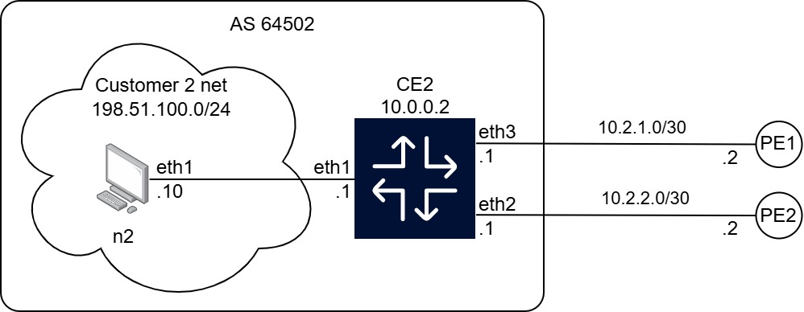
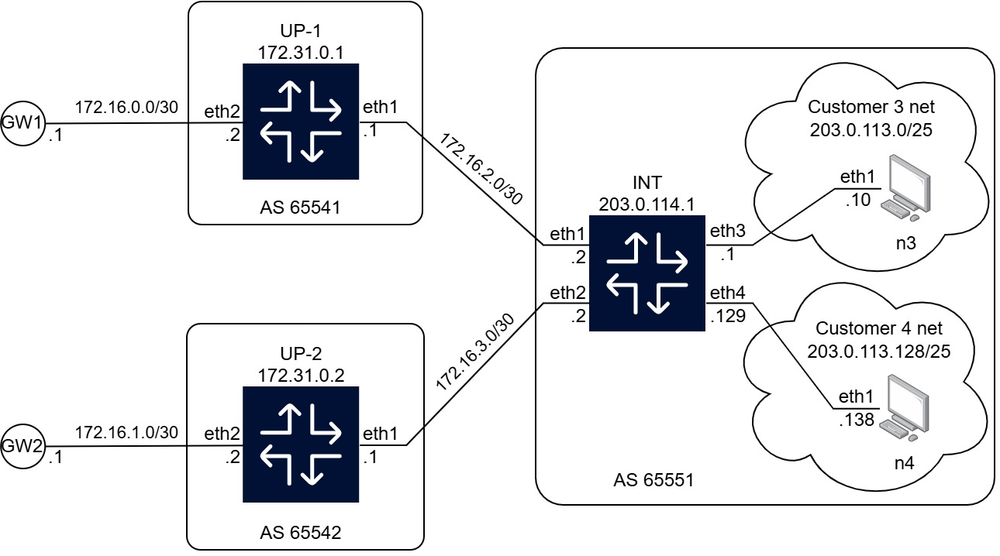

# Network Provisioning and Automation
Group project for Advanced Computer Networking course, MSc in Computer Engineering, Università di Pisa, A.Y. 2025/2026
##### Table of Contents  
- [Description](#description)  
- [Repository structure](#repository-structure)
- [Project deployment](#project-deployment)
- [Useful Containerlab commands](#useful-containerlab-commands)
- [Containers usage](#containers-usage)
  - [FRR nodes](#frr-nodes)
  - [Alpine nodes](#alpine-nodes)


## Description
Network to implement:

Chosen configuration:


<details>
<summary>Network details</summary>

### Customer 1 part

### Customer 2 part

### Core part

### Internet part


</details>

## Repository structure
Compact:
```
.
├───config
│   ├───alpine
│   ├───frr
│   ├───mngr
│   └───startup
├───doc
├───img
├───shell
└───template
    └───data
```

<details>

<summary>Extended structure:</summary>

```
.
│   acn.clab.yml
│   controller.py
│   launch.sh
│   readme.md
│
├───config
│   │
│   ├───alpine
│   │       alp-cfg.sh
│   │       dockerfile
│   │
│   ├───frr
│   │       daemons
│   │       dockerfile
│   │       frr-cfg.sh
│   │       vtysh.conf
│   │
│   ├───mngr
│   │       dockerfile
│   │       main.py
│   │       traffic-matrices.json
│   │
│   └───startup
│           *.conf
│           *.sh
│
├───doc
│       ACN Project description.pdf
│
├───img
│       *.drawio
│       *.jpg
│
├───shell
│       bridge.sh
│       clean.sh
│       images.sh
│       sshcert.sh
│       template.sh
│
└───template
    │   generator.py
    │   requirements.txt
    │   template_alp.j2
    │   template_frr.j2
    │
    └───data
            *.yaml
```

</details>

## Project deployment

The entire project can be deployed by launching the dedicated script `launch.sh`:
```bash
./launch.sh
```
Options available for the launch script:
```bash
>  ./launch.sh -h
Usage: ./launch.sh [OPTIONS]

Options (no arguments required):
  -i, --images      Build images (default: NO)
  -c, --no_clean    Clean previous launch (default: YES)
  -b, --bridge      Create bridges (default: NO)
  -t, --template    Compile templates (default: NO)
  -s, --sshkeep     Clean SSH certificates of nodes (default: YES)
  -h, --help        Show this help message and exit
```
For the first deployment of the project the user should run the launch script with the following options:
```bash
./launch.sh --images --bridge --template
```

### Project cleanup
The network can be destoryed by launching the dedicated script `clean.sh`:
```bash
./shell/clean.sh
```

<details>

<summary>In the following part we describe in detail the steps carried in the launch script</summary>

### Build images
 - Via the provided script: `./shell/images.sh`.
 - Content of the script:
    1. Create image for FRR nodes (it must contain OpenSSH package to allow ssh access) It runs the following command:
        ```bash
        docker build -t frr-ssh:10.4.1 ./config/frr
        ```
    2. Create image for manager node (it must contain OpenSSH and Paramiko package to allow programmatic SSH). It runs the following command:
        ```bash
        docker build -t python-ssh:3.12-alpine ./config/mngr
        ```
    3. Create image for Alpine nodes (it must contain paramiko package to allow programmatic SSH). It runs the following command:
        ```bash
        docker build -t alpine-ssh:3.19.1 ./config/alpine
        ```
Note that `frr-ssh:10.4.1`, `python-ssh:3.12-alpine` and `alpine-ssh:3.19.1` are the name of the images used in `acn.clab.yml`

### Create bridges
  - Via the provided script `./shell/bridge.sh`
  - Content of the script:
    ```bash
    sudo ip link add br-clab-core type bridge
    sudo ip link set br-clab-core up
    ```
Note that `br-clab-core` is the name of the bridge used in `acn.clab.yml`

### Compile templates
  - Via the provided script `./shell/template.sh`
  - Content of the script:
    ```bash
    for file in template/data/*.yaml; do
        python3 template/generator.py "$file"
        echo "$file" processed
    done
    ```

### Clear previous simulation
  - Via the provided script `./shell/clean.sh`
  - Content of the script:
    ```bash
    sudo containerlab destroy --cleanup -t acn.clab.yml

    # Print container possibly left out
    docker ps -a | grep acn-prj | awk '{print $1}' | xargs -r docker rm -f
    docker volume ls | grep acn-prj | awk '{print $2}' | xargs -r docker volume rm
    ip netns | grep clab
    ip netns | grep acn-prj
    ```
</details>


## Useful Containerlab commands

<details>

<summary>The main commands available in Containerlab</summary>

### Deploy
Deploy the network with containerlab
  ```bash
  sudo containerlab deploy [-t acn.clab.yml]
  ```

#### Redeploy
```bash
sudo containerlab redeploy [-t acn.clab.yml]
```

### Show topology
```bash
sudo containerlab graph [--topo -t acn.clab.yml]
```
Then open one of the proposed addresses with a browser

### Destroy
```bash
sudo containerlab destroy [-t acn.clab.yml]
```
To check if all containers have been destroyed:
```bash
docker ps -a
```
To manually destory containers:
```bash
sudo docker rm -f <container-id>
```
</details>


## Containers usage
### FRR nodes
- Access node (alternatives):
    ```bash
    docker exec -it <node-name> sh
    ```
    ```bash
    docker exec -it <node-name> vtysh
    ```
    ```bash
    ssh root@<node-mgmt-address>
    (password)> admin 
    ```
- Exit shell:
    ```bash
    exit
    ```

#### Useful commands
 - Interfaces
    - Show all available commands: `Node# show interface ?`
    - Show brief summary: `Node# show interface brief`
    - Show interfaces description: `Node# show interface description`
 - IP
    - Show all available commands: `Node# show ip ?`
    - Show routing table: `Node# show ip route`
    - Show BGP entries: `Node# show ip bgp`
    - Show OSPF entries: `Node# show ip ospf`
 - BGP
    - Show all available commands: `Node# show bgp ?`
    - Show brief summary: `Node# show bgp summary`
    - Show neighbors in detail: `Node# show bgp neighbors`

### Alpine nodes
- Access node
    ```bash
    docker exec -it <node-name> sh
    ```
    ```bash
    ssh root@<node-mgmt-address>
    (password)> admin 
    ```
- Exit shell:
    ```bash
    exit
    ```

#### Useful commands
- Show interfaces:
    - Full:  `Node# ip [addr | address]`
    - Specific:  `Node# ip [addr | address] show dev <interface name>`
