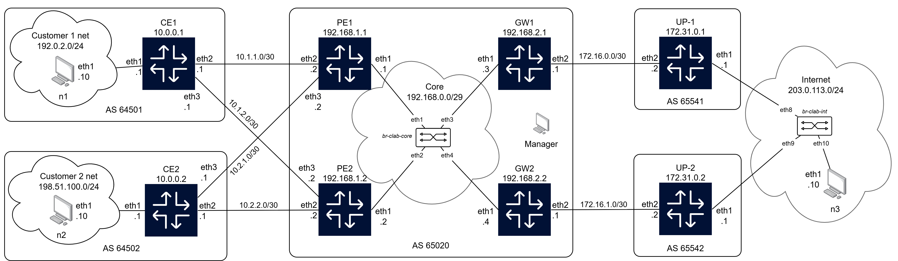

# Network Provisioning and Automation
Group project for Advanced Computer Networking course, MSc in Computer Engineering, Università di Pisa, A.Y. 2025/2026

## TODO
 - Decidere cosa fare della rete di management:
    - Decidere se lasciarla nella vrf deafult o in una separata (usare env: CLAB_VRF_MGMT come nell'esercizio del Virdis)
    - Quantomeno togliere la default route che va sulla management

 - Ho messo ip route replace negli Alpine (per la default route), perchè ip route add fa conflitto (anche su nodo appena creato). Direi che è sufficiente dirlo nella documentazione, replace fa semplicemenete add se non c'è niente, altrimenti fa flush+add
 
## Description
TODO

Our structure:


## Repository structure
Compact:
```
.
├───config
│   ├───frr
│   ├───alpine
│   ├───mngr
│   └───startup
├───doc
├───img
└───template
    └───data
```
Extended:
```
.
│   acn.clab.yml
│   br.sh
│   clean.sh
│   launch.sh
│   controller.py
│   readme.md
│
├───config
│   │   linux-host-cfg.sh
│   │
│   ├───alpine
│   │       alp-cfg.sh
│   │
│   ├───frr
│   │       daemons
│   │       frr-cfg.sh
│   │       vtysh.conf
│   │
│   ├───mngr
│   │       main.py
│   │
│   └───startup
│           *.conf
│           *.sh
│
├───doc
│       ACN Project description.pdf
│
├───img
│       *.drawio
│       *.png
│       *.jpg
│
└───template
    │   generator.py
    │   requirements.txt
    │   template_alp.j2
    │   template_frr.j2
    │
    └───data
            *.yaml
```

## Project deployment
The entire project can be deployed by launching the dedicated script `launch.sh`:
```bash
./launch.sh
```

The network can be destoryed by launching the dedicated script `clean.sh`:
```bash
./clean.sh
```
In the following part we describe the steps carried in the launch script.
### Deploy

1. Create bridges  
  Note that `br-clab-core` and `br-clab-int` are the name of the bridges used in `acn.clab.yml`
  - Via the provided script `br.sh`
  - Manually:
    ```bash
    sudo ip link add br-clab-core type bridge
    sudo ip link set br-clab-core up

    sudo ip link add br-clab-int type bridge
    sudo ip link set br-clab-int up
    ```

2. Deploy the network with containerlab
  ```bash
  sudo containerlab deploy [-t acn.clab.yml]
  ```

#### Redeploy
```bash
sudo containerlab redeploy [-t acn.clab.yml]
```

### Show topology
```bash
sudo containerlab graph [--topo -t acn.clab.yml]
```
Then open one of the proposed addresses with a browser

### Destroy
```bash
sudo containerlab destroy [-t acn.clab.yml]
```
To check if all containers have been destroyed:
```bash
docker ps -a
```
To manually destory containers:
```bash
sudo docker rm -f <container-id>
```

## Containers usage
### FRR nodes
- Access node
    ```bash
    docker exec -it <node-name> vtysh
    ```
- Exit shell:
    ```bash
    exit
    ```
- Show interfaces:
    - Full:  `Node# show [i | int | interfaces]`
    - Brief:  `Node# show [int | interfaces] [b | brief]`
    - Specific:  `Node# show [int | interfaces] <interface name>`

### Alpine nodes
- Access node
    ```bash
    docker exec -it <node-name> sh
    ```
- Exit shell:
 `ctrl`+`p`+`q`
- Show interfaces:
    - Full:  `/ # ip [addr | address]`
    - Specific:  `/ # ip [addr | address] show dev <interface name>`

## Useful commands
 - Interfaces
    - Show all available commands: `Node# show interface ?`
    - Show brief summary: `Node# show interface brief`
    - Show interfaces description: `Node# show interface description`
 - IP
    - Show all available commands: `Node# show ip ?`
    - Show routing table: `Node# show ip route`
    - Show BGP entries: `Node# show ip bgp`
    - Show OSPF entries: `Node# show ip ospf`
 - BGP
    - Show all available commands: `Node# show bgp ?`
    - Show brief summary: `Node# show bgp summary`
    - Show neighbors in detail: `Node# show bgp neighbors`